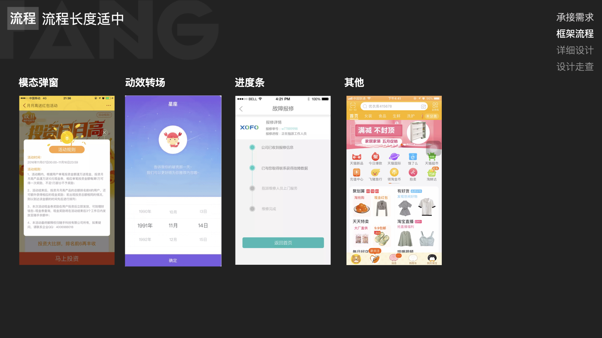
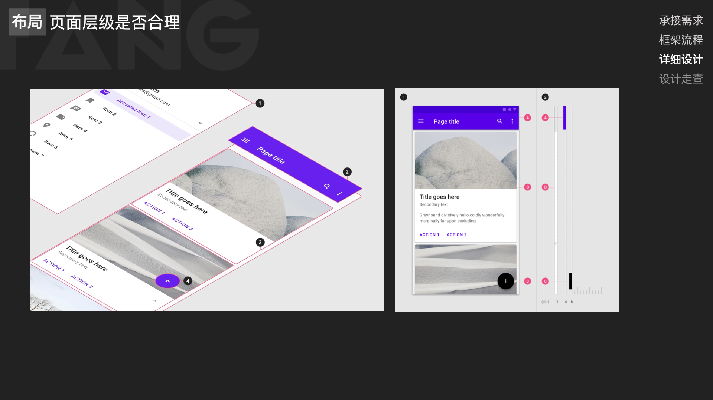
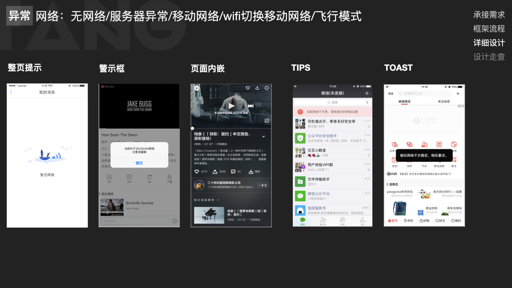

#交互设计自查表
最新版「豆瓣FM」的设计居然把设计师的「乌托邦」完美实现了，很多小细节的设计都值得研究。比如在歌单详情页手势向上滑动的时候，处于页面中间包含「播放」「分享」「点赞」的卡片会随着手势上滑而移动位置，并最终吸顶。这个设计细节值得讨论的有两方面：第一，吸顶的时候是直接盖住原有的Title Bar，这样会导致用户突然找不到「返回」在哪里有点迷失。此时只能通过手势从屏幕左侧边缘向右滑动来完成返回操作；或者是下滑操作才会露出带返回的Title Bar，然后点击返回。第二，在吸顶的那一刻会有手机振动的提示，这样会无形中提高「吸顶」动作的感知度。个人认为这里的设计可能正是为了弥补第一点带来的迷失感。

###交互第二次细节
最新版「豆瓣FM」的设计居然把设计师的「乌托邦」完美实现了，很多小细节的设计都值得研究。比如在歌单详情页手势向上滑动的时候，处于页面中间包含「播放」「分享」「点赞」的卡片会随着手势上滑而移动位置，并最终吸顶。这个设计细节值得讨论的有两方面：第一，吸顶的时候是直接盖住原有的Title Bar，这样会导致用户突然找不到「返回」在哪里有点迷失。此时只能通过手势从屏幕左侧边缘向右滑动来完成返回操作；或者是下滑操作才会露出带返回的Title Bar，然后点击返回。第二，在吸顶的那一刻会有手机振动的提示，这样会无形中提高「吸顶」动作的感知度。个人认为这里的设计可能正是为了弥补第一点带来的迷失感。